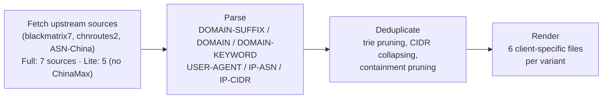

[](https://github.com/Mr-Grin/proxy-rules/actions/workflows/update.yml)

# proxy-rules

**Two deduplicated, daily-refreshed rulesets for mainland China network routing: `china` and `global`.**

Merges [blackmatrix7/ios_rule_script](https://github.com/blackmatrix7/ios_rule_script) (`China`, `ChinaMax`, `ChinaIPs`), [misakaio/chnroutes2](https://github.com/misakaio/chnroutes2) (BGP-sourced China IP ranges), and [missuo/ASN-China](https://github.com/missuo/ASN-China) (China-registered ASNs) into one canonical set, then renders it for **Shadowrocket, Surge, Loon, QuantumultX, and Clash**.

The repo ships **two rulesets**. Each is generated once and rendered into the syntax of every client, so a ruleset's directory holds one file per tool:

| Ruleset | Directory | What's in it |
|---|---|---|
| **china** | `china/full/`, `china/lite/` | Mainland China domains, IP ranges and ASNs (sources below) |
| **global** | `global/` | blackmatrix7's `Global` (domains and IPs combined) merged with its `Scholar` academic sites |

Which policy each ruleset gets (direct, proxy, a specific group) is up to you — you set it in your own `RULE-SET` line. Only the Shadowrocket module and the QuantumultX file have to carry one, so they ship a default (`DIRECT` for china, `PROXY` for global) that you can change.

Each directory contains `shadowrocket.list`, `shadowrocket.sgmodule`, `surge.list`, `loon.list`, `quantumultx.list` and `clash.yaml`.

**china** ships in two variants — pick one:

- **Full** (`china/full/`) — everything, including blackmatrix7's `ChinaMax`, by far the largest domain source.
- **Lite** (`china/lite/`) — same pipeline minus `ChinaMax`, ~85% fewer total entries. IP coverage stays nearly as complete (`ChinaIPs`/`chnroutes`/ASN-China overlap `ChinaMax` heavily), but domain-suffix coverage drops sharply — pick this if you mainly care about IP-based routing and want a smaller ruleset. **Recommended for mobile** (Shadowrocket/Loon/QuantumultX on iOS) — a much smaller file means faster rule-matching and lower memory use on-device.

---

## Subscribe

Pick your client and variant, paste the URL, set the subscription's refresh interval to 24h so it stays current.

### china

**Full**

| Client | URL |
|---|---|
| **Shadowrocket** (module, recommended) | `https://raw.githubusercontent.com/Mr-Grin/proxy-rules/main/china/full/shadowrocket.sgmodule` |
| **Shadowrocket** (raw rule) | `https://raw.githubusercontent.com/Mr-Grin/proxy-rules/main/china/full/shadowrocket.list` |
| **Surge** | `https://raw.githubusercontent.com/Mr-Grin/proxy-rules/main/china/full/surge.list` |
| **Loon** | `https://raw.githubusercontent.com/Mr-Grin/proxy-rules/main/china/full/loon.list` |
| **QuantumultX** | `https://raw.githubusercontent.com/Mr-Grin/proxy-rules/main/china/full/quantumultx.list` |
| **Clash** | `https://raw.githubusercontent.com/Mr-Grin/proxy-rules/main/china/full/clash.yaml` |

**Lite** (no `ChinaMax`, recommended for mobile — smaller file size)

| Client | URL |
|---|---|
| **Shadowrocket** (module, recommended) | `https://raw.githubusercontent.com/Mr-Grin/proxy-rules/main/china/lite/shadowrocket.sgmodule` |
| **Shadowrocket** (raw rule) | `https://raw.githubusercontent.com/Mr-Grin/proxy-rules/main/china/lite/shadowrocket.list` |
| **Surge** | `https://raw.githubusercontent.com/Mr-Grin/proxy-rules/main/china/lite/surge.list` |
| **Loon** | `https://raw.githubusercontent.com/Mr-Grin/proxy-rules/main/china/lite/loon.list` |
| **QuantumultX** | `https://raw.githubusercontent.com/Mr-Grin/proxy-rules/main/china/lite/quantumultx.list` |
| **Clash** | `https://raw.githubusercontent.com/Mr-Grin/proxy-rules/main/china/lite/clash.yaml` |

### global

blackmatrix7's `Global` plus `Scholar` (academic sites), merged and deduplicated.

| Client | URL |
|---|---|
| **Shadowrocket** (module, recommended) | `https://raw.githubusercontent.com/Mr-Grin/proxy-rules/main/global/shadowrocket.sgmodule` |
| **Shadowrocket** (raw rule) | `https://raw.githubusercontent.com/Mr-Grin/proxy-rules/main/global/shadowrocket.list` |
| **Surge** | `https://raw.githubusercontent.com/Mr-Grin/proxy-rules/main/global/surge.list` |
| **Loon** | `https://raw.githubusercontent.com/Mr-Grin/proxy-rules/main/global/loon.list` |
| **QuantumultX** | `https://raw.githubusercontent.com/Mr-Grin/proxy-rules/main/global/quantumultx.list` |
| **Clash** | `https://raw.githubusercontent.com/Mr-Grin/proxy-rules/main/global/clash.yaml` |

**Rule order matters** — the first matching `RULE-SET` wins, and a few hundred domains appear in both rulesets (for example `nature.com` and `acm.org`: Scholar sites that are also in the China list). Whichever ruleset you list first decides those domains:

```
RULE-SET,<first URL>,<policy>
RULE-SET,<second URL>,<policy>
```

<details>
<summary><b>Setup instructions per client</b></summary>
<br>

Same steps for every ruleset and variant — just use the URL from whichever table above you picked, with whatever policy you want in place of `<policy>` (`DIRECT`, `PROXY`, or the name of a proxy group). The Shadowrocket module and the QuantumultX file ship a default policy (`DIRECT` for china, `PROXY` for global).

**Shadowrocket — module (recommended)**
Configuration → **Module** → **+** → paste the `.sgmodule` URL → Download. Toggle the whole module on/off from the Module list; no manual config editing.

**Shadowrocket — manual rule**
Add to a profile's `[Rule]` section:
```
RULE-SET,<the .list URL above>,<policy>
```

**Surge**
Add to `[Rule]`:
```
RULE-SET,<the URL above>,<policy>
```

**Loon — remote rule (recommended)**
Configuration → **Rule** → **+** → paste the URL, set an alias, choose a policy → Save.

**Loon — manual rule**
Add to `[Rule]`:
```
RULE-SET,<the URL above>,<policy>
```

**QuantumultX**
Add to `[filter_remote]`:
```
<the URL above>, tag=china, enabled=true
```
A default policy is baked into the file; add `force-policy=<policy>` to the tag to override it.

**Clash**
Needs a `rule-providers` block rather than a one-liner:
```yaml
rule-providers:
  china:
    type: http
    behavior: classical
    url: "<the .yaml URL above>"
    path: ./ruleset/china.yaml
    interval: 86400
rules:
  - RULE-SET,china,<policy>
```

</details>

## Rule statistics

**Full**

<!-- RULE-STATS:START -->

| Type | Count |
|---|---|
| DOMAIN-SUFFIX | 111,656 |
| DOMAIN | 0 |
| DOMAIN-KEYWORD | 14 |
| USER-AGENT | 51 |
| IP-ASN | 5,230 |
| IP-CIDR (v4) | 8,267 |
| IP-CIDR6 (v6) | 4,240 |
| **TOTAL** | **129,458** |

<!-- RULE-STATS:END -->

**Lite** (no `ChinaMax`)

<!-- RULE-STATS-LITE:START -->

| Type | Count |
|---|---|
| DOMAIN-SUFFIX | 3,691 |
| DOMAIN | 0 |
| DOMAIN-KEYWORD | 9 |
| USER-AGENT | 28 |
| IP-ASN | 5,230 |
| IP-CIDR (v4) | 7,225 |
| IP-CIDR6 (v6) | 4,222 |
| **TOTAL** | **20,405** |

<!-- RULE-STATS-LITE:END -->

**Global** (Global + Scholar)

<!-- RULE-STATS-GLOBAL:START -->

| Type | Count |
|---|---|
| DOMAIN-SUFFIX | 29,296 |
| DOMAIN | 125 |
| DOMAIN-KEYWORD | 36 |
| USER-AGENT | 43 |
| IP-ASN | 0 |
| IP-CIDR (v4) | 115 |
| IP-CIDR6 (v6) | 4 |
| **TOTAL** | **29,619** |

<!-- RULE-STATS-GLOBAL:END -->

All three auto-updated by [`scripts/build_rules.py`](scripts/build_rules.py) every run; each reflects that ruleset's canonical merged set (Clash's output additionally drops `USER-AGENT` rows — see [output files](#output-files)). Dropping `ChinaMax` cuts domain-suffix coverage by ~97%, but barely touches IP coverage since `ChinaIPs`/`chnroutes`/ASN-China independently cover nearly the same address space.

## How it's built

Each ruleset variant's six client files are generated from **one canonical rule set per variant** by [`scripts/build_rules.py`](scripts/build_rules.py) — nothing is fetched or maintained separately per client. Lite reruns the exact same pipeline with `ChinaMax.list`/`ChinaMax_Domain.list` dropped from the source list before fetching.



**1. Fetch & parse** the sources listed under [why these sources](#why-these-sources) (minus `ChinaMax` for the Lite variant; the global ruleset reads Surge's `Global_All.list` and Shadowrocket's `Scholar.list`), reading every rule type each one defines.

**2. Deduplicate** — not just exact-line matches:

| Rule type | Dedup strategy |
|---|---|
| `DOMAIN-SUFFIX` | Built into a trie; a suffix already covered by a shorter one in the set is pruned (e.g. `doh.360.cn` under `cn`). |
| `IP-CIDR` | Merged per IP version with `ipaddress.collapse_addresses`, which also drops CIDRs that are subsets of a larger included block. |
| `DOMAIN` / `IP-ASN` | Exact-value dedup. `DOMAIN` entries already covered by a kept `DOMAIN-SUFFIX` are dropped too. |
| `DOMAIN-KEYWORD` / `USER-AGENT` | Exact-value dedup **plus** containment pruning — if one pattern's matches are a provable subset of another's, the narrower one is dropped (e.g. keyword `qiyi` makes `iqiyi` redundant; `USER-AGENT,QQ*` makes `QQMusic*` redundant). Wildcards are modeled as anchored glob patterns so this only fires when safe; a bare `?` wildcard opts a pattern out entirely. |
| IPv4-mapped IPv6 | Upstream `ChinaMax.list` writes 29 addresses as `::ffff:a.b.c.d/128`, which never match real IPv4 connections in any client. These are converted back to plain IPv4 `/32` before collapsing. |

**3. Render** the deduplicated set into each client's syntax:

### Output files

Same six filenames under `china/full/`, `china/lite/` and `global/`:

| File | Client | Notes |
|---|---|---|
| `shadowrocket.list` | Shadowrocket | `RULE-SET`; IPv4 and IPv6 CIDRs share one `IP-CIDR` type |
| `shadowrocket.sgmodule` | Shadowrocket | Module wrapping a `RULE-SET` reference to that variant's `shadowrocket.list`, addable from Configuration → Module |
| `surge.list` | Surge | `RULE-SET`; IPv6 CIDRs use a separate `IP-CIDR6` type |
| `loon.list` | Loon | Same syntax as Surge |
| `quantumultx.list` | QuantumultX | Uses `HOST`/`HOST-SUFFIX`/`HOST-KEYWORD`/`IP6-CIDR`; every line carries a default policy (`direct` for china, `proxy` for global) so it works standalone |
| `clash.yaml` | Clash | `behavior: classical` rule-provider; **`USER-AGENT` rules are dropped** — classical mode has no such rule type |

blackmatrix7's per-client directories are ~99% the same data with different serialization; a few platform-exclusive extras (QuantumultX's one `HOST-WILDCARD` rule, Surge/Clash's desktop-only `PROCESS-NAME` rules) aren't reproduced here. Trade-off: one build pipeline and guaranteed-identical domain/IP coverage across every client, at the cost of a handful of rarely-relevant platform-specific micro-rules.

## Automation

[`.github/workflows/update.yml`](.github/workflows/update.yml) runs daily at **21:30 UTC / 05:30 Beijing** — a few hours after upstream's own daily refresh:

1. Regenerates all output files (six per ruleset variant: Full, Lite and Global).
2. Discards any file whose only change is the `# UPDATED:` timestamp, so no-op days produce no commit.
3. Commits and pushes only the files that actually changed.

Trigger a run manually anytime from the **Actions** tab (`workflow_dispatch`).

## Why these sources

<details>
<summary>Diffing four candidate China rulesets to decide what's actually worth merging</summary>
<br>

Diffing the China-related rulesets (`China`, `ChinaIPs`, `ChinaIPsBGP`/`chnroutes.txt`, `ChinaMax`) showed:

- **`chnroutes.txt`** is fetched directly from misakaio's [chnroutes2](https://github.com/misakaio/chnroutes2) rather than blackmatrix7's `ChinaIPsBGP.list` mirror, since that mirror lags live upstream by weeks. It's currently a 100% address-space subset of `ChinaMax` — zero unique addresses today — but it's kept anyway since `collapse_cidrs()` dedupes it for free, and it guards against BGP churn landing a route here before `ChinaMax` picks it up.
- **`ChinaIPs`** is ~99.93% overlapping with `ChinaMax`, but the remaining ~0.07% (≈247k addresses) is real unique address space that `collapse_cidrs()` merges for free — so it's included.
- **`China`** (the small curated list) contributes real value `ChinaMax` doesn't have: 5 Tencent Cloud HK/SG IP ranges used by WeChat/QQ backends, a `microsoft` `DOMAIN-KEYWORD`, and ~162 domains (`bootcdn.net`, `baidustatic.com`, `51.la`, etc.) missing from `ChinaMax`.
- blackmatrix7's lists carry only one hand-picked `IP-ASN` entry between them, so [missuo/ASN-China](https://github.com/missuo/ASN-China)'s `ASN.China.list` — a comprehensively scraped, independently refreshed registry of thousands of China-registered ASNs — is merged in too. It uses `//` comments rather than blackmatrix7's `#`-only convention, which the parser accounts for.

**Result:** `China.list` + `China_Domain.list` + `ChinaMax.list` + `ChinaMax_Domain.list` + `ChinaIPs.list` + `chnroutes.txt` + `ASN.China.list` merged into the canonical set (Full). Lite uses the same list minus `ChinaMax.list` + `ChinaMax_Domain.list`.

**Global:** `Surge/Global/Global_All.list` + `Shadowrocket/Scholar/Scholar.list`. Global comes from the Surge directory because Surge's `Global_All.list` is the one file that carries Global's domains and IPs together (the Shadowrocket directory splits them into `Global.list` and `Global_Domain.list`); the Surge-only `PROCESS-NAME` rule is dropped like in the China rulesets, and its IPv6 ranges are kept. Scholar is merged in so there are only two rulesets.

</details>
